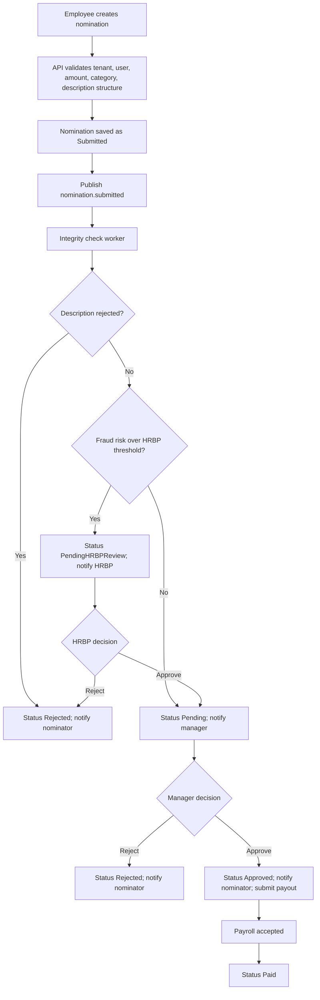

# Business Architecture

## Business Objective

The Award Nomination App enables organizations to run employee recognition programs with configurable rules, controlled approval workflows, fraud-aware monitoring, and auditable payout processing.

The business architecture centers on four outcomes:

- Make employee recognition easier to submit and approve.
- Protect recognition budgets from abuse, favoritism, and inconsistent decisions.
- Give HR and executives visibility into recognition behavior.
- Support tenant-specific rules without creating separate products per customer.

## Business Capabilities

| Capability | Description |
| --- | --- |
| Nomination management | Create, submit, approve, reject, and track employee award nominations. |
| Tenant configuration | Configure tenant branding, domain, locale, currency, award limits, categories, certificates, and description rules. |
| Identity and roster alignment | Map signed-in Entra ID users to tenant-scoped application users and manager relationships. |
| Approval workflow | Route nominations to the beneficiary manager for approval after integrity checks. |
| HRBP review | Route risky or suspicious nominations to HRBP users before manager approval. |
| Integrity analytics | Detect abnormal behavior, duplicate descriptions, graph patterns, and suspicious approval behavior. |
| Notification management | Send manager approval requests, outcome emails, HRBP alerts, access requests, and payroll failure notices. |
| Payroll coordination | Submit approved awards to payroll providers through a broker and track payout status. |
| Executive analytics | Provide spend trends, top recipients, top nominators, fraud alerts, approval metrics, diversity metrics, category breakdown, and forecasts. |
| Investigation support | Provide admin-facing AI ask and investigate workflows with export support. |
| Auditability | Preserve impersonation audit logs, event processing logs, workflow status, fraud scores, HRBP decisions, and payout references. |

## Stakeholders

| Stakeholder | Needs |
| --- | --- |
| Employee nominator | Simple nomination flow, clear award limits, responsive feedback, history tracking. |
| Beneficiary | Recognition and optional certificate or payout notification. |
| Manager approver | Clear approval queue, context, email action links, reject reason capture. |
| HRBP reviewer | Review queue for suspicious nominations, fraud explanations, pair history, approve/reject decisions. |
| Payroll BP | Pay-data lookup and confidence that approved awards reach payroll. |
| Tenant administrator | Branding, user roles, impersonation support, analytics, logs, and tenant-specific configuration. |
| Executive sponsor | Spend, fairness, fraud risk, forecast, trend, and operational visibility. |
| Platform operator | Deployment, health, logs, traces, alerting, rollback, and cost controls. |
| Security/compliance reviewer | Tenant isolation, identity controls, auditability, secrets management, and AI governance. |

## Tenant Model

The tenant is the primary business boundary. The platform maps each Entra ID tenant GUID to an internal `TenantId` in the `Tenants` table.

Tenant-specific configuration includes:

- Tenant name.
- Azure AD tenant ID.
- Domain.
- Site URL.
- Branding colors and logo.
- Locale and currency.
- Award minimum and maximum.
- Nomination categories.
- Description quality policy.
- Certificate settings.
- Integrity routing thresholds.
- Payroll provider configuration.

Business rule: users from an unregistered Entra tenant are rejected. Users from a registered tenant must also exist in that tenant roster.

## User Personas and Roles

| Role | Source | Business function |
| --- | --- | --- |
| Standard user | Tenant roster and Entra token | Submit nominations, view history, approve if manager. |
| Manager approver | Manager relationship in `Users.ManagerId` | Approve or reject beneficiary nominations. |
| HRBP | Application role in `UserRoles` | Review flagged nominations. |
| PayrollBP | Application role in `UserRoles` | Access payroll lookup and payout context. |
| Admin | Entra app role such as `AWard_Nomination_Admin` | Analytics, impersonation, audit logs, model refresh, nomination logs. |
| Support | Application role in `UserRoles` | Receive payroll failure notifications where configured. |

## Nomination Lifecycle

## Business Rules

### Nomination Rules

- A nomination must have a beneficiary, amount, and description.
- The amount must fall within tenant-specific bounds.
- The beneficiary must belong to the same tenant.
- The beneficiary must have a manager assigned.
- If tenant categories exist, `CategoryId` is required and must be valid for the tenant.
- Descriptions must satisfy tenant-specific word or character count policy.
- Boilerplate phrases can be blocked synchronously.

### Integrity Rules

- Submitted nominations are screened asynchronously.
- Semantic description checks can reject or flag nominations before manager review.
- ML fraud scoring uses tenant-specific models when available.
- Routing thresholds can be tenant-specific.
- HRBP decisions create labels that feed future model training.

### Approval Rules

- Only the assigned approver can approve or reject a manager approval item.
- Reject decisions capture reason and actor.
- Approved items can generate certificates if the tenant enables the feature.
- Approved items trigger notification and payout processing.

### Admin Rules

- Admin access is based on Entra app roles.
- Admin impersonation is tenant-scoped and audited.
- Admin analytics are tenant-scoped.

## Exception Handling

| Exception | Business behavior |
| --- | --- |
| Unknown tenant | Reject login with 403. |
| User not in tenant roster | Reject login with 404. |
| Wrong domain | Frontend shows wrong-portal guidance based on tenant config. |
| Missing manager | Reject nomination submission. |
| Invalid category | Reject nomination submission. |
| Description fails policy | Reject or route according to description/integrity configuration. |
| Fraud model unavailable | Route conservatively as clean while logging model unavailable behavior. |
| Service Bus publish failure | API logs warning; nomination remains saved and can be recovered operationally. |
| Duplicate Service Bus delivery | Workers use `ProcessedEvents` for idempotent side effects. |
| Payroll submission failure | Broker publishes `payroll.failed`; auxiliary worker notifies support roles. |

## Value Proposition by Stakeholder

| Stakeholder | Value |
| --- | --- |
| Employees | Easy recognition submission and transparent status tracking. |
| Managers | Clear decision queue and email-based action support. |
| HRBP | Focused review of high-risk items instead of reviewing every award. |
| Payroll | Cleaner handoff from approved recognition to off-cycle bonus processing. |
| Executives | Spend, fairness, risk, and forecast visibility. |
| Tenant admins | Configurable, branded, multilingual recognition workflow. |
| Security and audit teams | Tenant isolation, RBAC, audit logs, and traceable event processing. |

