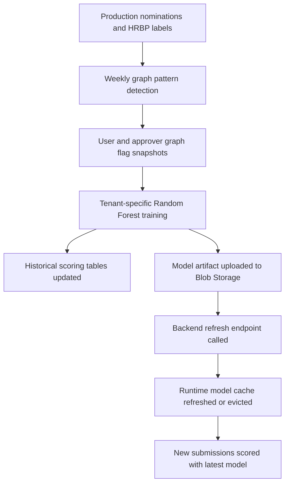

# AI/ML Architecture and Model Governance

## AI/ML Objectives

The platform uses AI and ML to improve recognition integrity, not to replace human judgment.

Primary objectives:

- Detect suspicious nomination relationships.
- Detect duplicate or low-quality descriptions.
- Detect outlier award behavior.
- Route risky nominations to HRBP review.
- Provide explainable signals to reviewers and admins.
- Forecast future review load and budget pacing.
- Support analytics questions and investigations.

## AI/ML Components

| Component | Location | Purpose |
| --- | --- | --- |
| Description checks | `integrity-check/description_check.py` | Category alignment, duplicate description, optional LLM semantic review. |
| Submission fraud scoring | `integrity-check/fraud_check.py` | Tenant-specific P2P Random Forest inference, risk level, warning flags, SHAP explanation. |
| Model loader/cache | `backend/fraud_ml.py`, `integrity-check/fraud_check.py` | Lazy-load tenant model artifacts from Blob Storage. |
| Weekly graph analytics | `fraud-analytics-job/graph_pattern_detector.py` | Ring, desert, super nominator, approver affinity, copy-paste, transactional language, hidden candidate detection. |
| Weekly model training | `fraud-analytics-job/train_fraud_model.py` | Per-tenant Random Forest training and historical scoring. |
| Forecasting | `fraud-analytics-job/forecast_models.py`, `backend/utils/forecasting.py` | Review load and budget pacing forecasts. |
| Admin Ask | `backend/agents/ask_agent.py` | Tenant-scoped analytics Q&A. |
| Admin Investigate | `backend/agents/orchestrator` | Multi-agent investigation, export, and notification support. |

## Fraud Risk Types

The platform is designed to detect or highlight:

- Reciprocal nominations.
- Repeated same-pair nominations.
- High amount outliers.
- Nominator concentration.
- Super nominators.
- Nomination rings.
- Approver affinity.
- Copy-paste nominations.
- Transactional or quid-pro-quo language.
- Hidden candidates mentioned in text but never directly nominated.
- Nomination deserts where teams receive little or no recognition.
- Rapid or unusual approval patterns.

## Feature Engineering

The fraud model combines:

- Amount features:
  - Tenant-scoped z-score.
  - High amount flag.
- Relationship features:
  - Pair nomination count.
  - Reciprocal nomination flag.
  - Nominator and beneficiary history.
- Temporal features:
  - Time windows and event date features.
  - Holiday/calendar context where available.
- Semantic features:
  - Description similarity.
  - Duplicate/copy-paste similarity.
  - Category fit score.
- Graph features:
  - Cycle flag.
  - Super nominator flag.
  - Cluster size.
  - Graph pattern participation.
  - Approver pair signals.
- Category features:
  - Category fraud rate and global fallback rate.

Important governance point: amount statistics are tenant-scoped. Cross-tenant scoring would corrupt comparisons because tenants may use different currencies and award ranges.

## Model Architecture

### Random Forest

The weekly job trains tenant-specific models:

- P2P model for nominator-to-beneficiary fraud likelihood.
- Approver model for approver behavior and historical scoring where enough data exists.

Artifacts are stored as:

```text
fraud_detection_model_tenant_<TenantId>.pkl
```

The artifact includes:

- Model objects.
- Scalers.
- Feature column lists.
- Tenant-scoped amount mean and standard deviation.
- Category fraud rate maps.
- Global fraud rate.
- Embedding model name.

### Isolation Forest Bootstrap

When labeled fraud data is limited, the training process can bootstrap labels with an Isolation Forest. These bootstrapped labels should be treated as weak labels until enough HRBP-confirmed outcomes are available.

### Semantic Models

Sentence-transformer models support:

- Category alignment.
- Duplicate description checks.
- Copy-paste graph findings.
- Description similarity features.

Tenant configuration can specify embedding model choice, enabling multilingual support.

### Azure OpenAI

Azure OpenAI supports:

- Optional semantic checks.
- Plain-language explanation generation from SHAP/feature contributions.
- Admin Ask analytics.
- Multi-agent investigations.

## Scoring and Routing

At submission time:

1. Nomination is saved as `Submitted`.
2. Worker loads nomination details.
3. Description checks run first.
4. Description rejection can stop the workflow.
5. Fraud assessment calculates a 0-100 score.
6. Score is mapped to risk level using tenant thresholds.
7. Worker routes:
   - Clean: `Pending`.
   - Flagged: `PendingHRBPReview`.
   - Rejected description: `Rejected`.

Risk levels:

- `NONE`
- `LOW`
- `MEDIUM`
- `HIGH`
- `CRITICAL`
- `UNKNOWN`

## Explainability

Explainability mechanisms:

- Warning flags from interpretable thresholds.
- Feature summaries saved with HRBP flags.
- SHAP top-feature contributions for flagged nominations.
- LLM-generated plain-English explanations where configured.
- HRBP pair history endpoint.
- Graph findings with affected users, nomination IDs, detail, severity, and export.

Reviewer design principle: do not expose raw ML internals as the only explanation. Provide business-readable reasons and supporting evidence.

## Human Review Workflow

The system is human-in-the-loop:

- Fraud scores route nominations to HRBP review.
- HRBP can approve or reject flagged nominations.
- HRBP decisions update labels:
  - Approved flagged nomination -> legitimate label.
  - Rejected flagged nomination -> fraud label.
- Labels feed future retraining.

This creates a feedback loop between model output and human review.

## Model Lifecycle



## Drift and Monitoring

Recommended monitoring:

- Fraud score distribution by tenant.
- Review queue volume and age.
- HRBP approve/reject rate for flagged items.
- False positive proxy: flagged but HRBP-approved.
- False negative proxy: manager-approved items later marked suspicious.
- Feature distribution drift.
- Model availability and blob load failures.
- Time since last successful training job.
- Forecast error over time.

## Governance Controls

| Control | Current or recommended implementation |
| --- | --- |
| Tenant-specific models | Current design stores per-tenant artifacts. |
| Human-in-the-loop review | Current HRBP workflow. |
| Explainable decisions | Current flags, summaries, SHAP, and optional explanation. |
| Training lineage | Recommended: persist artifact metadata, code version, training window, metrics. |
| Label governance | Current HRBP labels; recommended reviewer notes and appeal process. |
| Bias/fairness checks | Current diversity metrics; recommended model fairness review by department, location, gender if legally/ethically available. |
| Model rollback | Recommended: keep prior model artifacts and metadata in Blob Storage. |
| Change approval | Recommended: model release checklist for threshold and feature changes. |

## Ethical AI Considerations

- Fraud scores should be decision-support signals, not automatic punitive action.
- HRBP review should consider context and allow legitimate exceptions.
- Explanations should avoid overclaiming certainty.
- Nomination text may include sensitive personal information and should be protected.
- Fairness should be reviewed across recipient groups, departments, and manager chains.
- Tenants should be able to tune thresholds and review policies.

