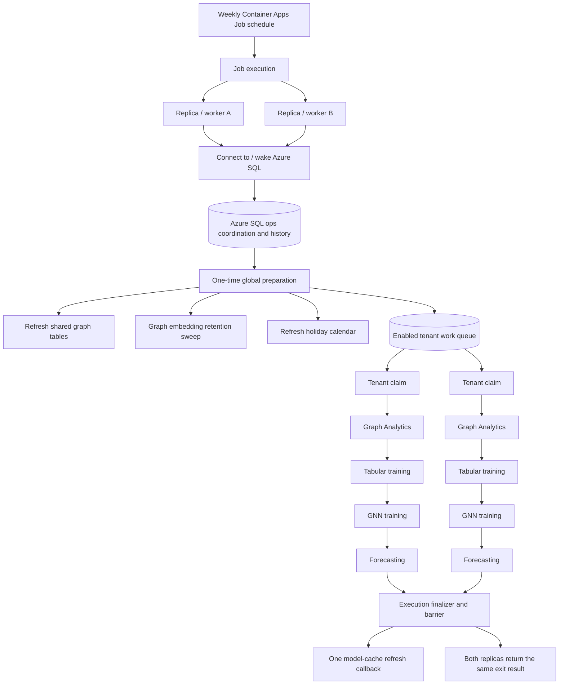

# Fraud Analytics Job Parallelism and Tenant Controls — Implementation Plan

**Status:** Approved for implementation  
**Date:** 2026-09-28  
**Applies to:** `fraud-analytics-job`, Terraform Container Apps Job configuration,
Azure SQL, backend Setup API, and the tenant-admin Setup UI

## 1. Goal

The scheduled fraud analytics job currently processes every tenant sequentially
inside one Azure Container Apps Job replica. The pipeline has grown to five
stages and routinely reaches the configured two-hour replica timeout.

This change has two goals:

1. Run tenant analytics across two Container Apps Job replicas without running
   the same tenant twice or allowing replicas to modify shared preparation data
   concurrently.
2. Let a tenant administrator pause or resume scheduled fraud analytics for
   their own tenant from Setup.

The design must preserve tenant isolation, current model publication guarantees,
failure visibility, temporal audit history, and safe retry behavior.

## 2. Current state

The Container Apps Job is currently configured with:

```hcl
replica_timeout_in_seconds = 7200
replica_retry_limit        = 1

schedule_trigger_config {
  parallelism              = 1
  replica_completion_count = 1
}
```

`run_job.py` runs the following stages in stage-major order:

1. Graph Analytics
2. Tabular model training
3. GNN model training
4. Holiday synchronization
5. Forecast models

Each tenant-aware stage then loops through every tenant. The runner already
supports a single-tenant filter, and each tenant-aware stage accepts a tenant
list, but tenant assignment is not coordinated across replicas.

Graph Analytics also performs a global `DELETE` and rebuild of
`dbo.NomGraph_Person` and `dbo.NomGraph_Nominated`. Holiday synchronization is
global as well. Starting two copies of the current runner would therefore:

- process every tenant twice;
- race while rebuilding the shared graph tables;
- repeat holiday synchronization;
- invoke the model-cache refresh callback more than necessary; and
- make the overall execution result ambiguous.

## 3. Decisions

The following decisions are approved for the initial implementation.

### 3.1 Execution model

- Keep one scheduled Azure Container Apps Job.
- Configure two parallel replicas for each scheduled execution.
- Set `replica_completion_count` to the same value as `parallelism`.
- Use Azure SQL as the coordination and tenant work-claim store.
- Use `CONTAINER_APP_JOB_EXECUTION_NAME` as the shared execution identifier.
- Generate a process-local UUID as the worker identifier. Azure documents a job
  execution name but does not expose a stable zero-based job replica index.
- Change orchestration from stage-major to tenant-major after one-time global
  preparation.
- Both replicas wait at an execution barrier and return the same final result.

### 3.2 Tenant assignment

- Do not statically assign tenant IDs in Terraform.
- Each replica claims the next pending enabled tenant transactionally.
- Faster replicas may claim more tenants; work is balanced by actual duration,
  not tenant count.
- A renewable SQL lease permits abandoned work to be reclaimed after a replica
  exits or is interrupted.
- Processing is at-least-once. Tenant stages must remain idempotent or publish
  new state atomically so a retry cannot expose a partial result.

### 3.3 Tenant control

- Store the tenant setting in `dbo.Tenants.integrity_config` using the new
  integrity terminology:

```json
{
  "integrity_analytics_job": {
    "enabled": true
  }
}
```

- Missing, null, malformed, or partial configuration defaults to `enabled=true`
  so existing tenants continue to run.
- Use a positive `enabled` field in storage and the API. The UI may describe the
  disabled state as “Paused.”
- Disabling the scheduled job does not disable live fraud inference, remove
  models, clear Graph findings, or change score routing. Existing serving
  artifacts remain active.
- A tenant already being processed continues to completion. A tenant disabled
  before it is claimed is skipped, even if it was included when the execution
  queue was initialized.
- Re-enabling a tenant makes it eligible for the next scheduled or manually
  started execution. It does not automatically start an execution.

### 3.4 Setup ownership and audit

- Add an **Analytics Jobs** sub-tab to the tenant-admin Setup area.
- Add a dedicated `GET/PUT /api/admin/setup/analytics-job` contract instead of
  mixing job operations into scoring and routing settings.
- Derive the tenant exclusively from the authenticated admin. Do not accept a
  tenant ID from the request body or URL.
- Reject writes during impersonation using the existing `require_setup_admin`
  dependency.
- Update the tenant's `updated_at` and `updated_by` values. Because `dbo.Tenants`
  is system-versioned, each change is retained in temporal history.

### 3.5 Operational schema and history

- Create a dedicated `ops` SQL schema, owned by `dbo`, for job coordination
  state and operational history.
- Use three tables:
  - `ops.IntegrityAnalyticsJobRuns` — one row per Container Apps Job execution;
  - `ops.IntegrityAnalyticsTenantRuns` — one claimable/leased row per execution and
    tenant; and
  - `ops.IntegrityAnalyticsStageAttempts` — one append-oriented row per tenant-stage
    attempt.
- Do not create a separate worker table initially. A process-generated
  `WorkerId` on tenant and stage-attempt rows is sufficient to reconstruct which
  replica processed each tenant and stage.
- Keep coordination fields relational. Use JSON only for bounded diagnostic or
  summary details that are not used to claim work, hold leases, determine final
  status, or drive alerts.
- Treat the `ops` tables as authoritative operational state, not disposable log
  output. `dbo.IntegrityComponentStatus` remains the source for currently
  serving component availability and version.

### 3.6 Timeout and retry

- Raise the default replica timeout to four hours (`14400` seconds). Parallelism
  reduces elapsed time but does not guarantee that the slowest tenant always
  finishes within two hours.
- Keep one replica retry. Azure recommends retries and at-least-once-safe work
  for long-running jobs because platform maintenance can interrupt a replica.
- Make timeout, retry limit, parallelism, and completion count explicit module
  variables rather than hard-coded resource values.

## 4. Target architecture



## 5. Execution lifecycle

### 5.1 Register execution

Each replica first runs the existing SQL connection/retry bootstrap. Both may
participate in waking a paused serverless database; this operation is safe and
must happen before coordination because the coordinator itself is stored in
Azure SQL.

After SQL is available, each replica reads:

- `CONTAINER_APP_JOB_NAME`;
- `CONTAINER_APP_JOB_EXECUTION_NAME`; and
- its generated `worker_id`.

The replica idempotently creates or reads the execution ledger row. A unique key
on the Container Apps execution name prevents duplicate execution records.

### 5.2 Global preparation

One replica becomes preparation leader through a SQL application lock or an
atomic state transition. The leader:

1. refreshes the shared graph node and edge tables in one transaction;
2. performs the shared Graph embedding retention sweep;
3. synchronizes holidays; and
4. creates tenant work rows for tenants that are enabled at that time.

The other replica waits for preparation status `READY`. If the leader exits,
its SQL lock is released. After the preparation lease expires, another worker
may safely rerun preparation. Shared refreshes must commit atomically so a retry
cannot observe or leave half-populated graph data.

If global preparation reaches terminal status `FAILED`, no tenant work starts
and both replicas return failure.

### 5.3 Claim tenant

Claiming must be one atomic database operation using row/update locks and
skip-locked semantics appropriate for Azure SQL, for example the equivalent of
`UPDLOCK`, `READPAST`, and `ROWLOCK`.

The claim operation:

1. selects one `PENDING` row;
2. sets it to `RUNNING`;
3. records `worker_id`, `started_at`, `lease_expires_at`, and attempt count; and
4. returns the tenant ID to the worker.

Immediately after claiming, the worker rereads the tenant enable flag. If it is
now disabled, the work row becomes `SKIPPED_DISABLED` and no analytics stage is
run for that tenant.

### 5.4 Maintain lease

Tenant processing may take much longer than a short SQL lease. A background
heartbeat, using its own database connection, renews the lease while the
tenant's stages are running. A starting point is:

- heartbeat every 60 seconds;
- lease expiry after 5 minutes without a heartbeat.

The final values should be configurable and tested against expected database
resume and transient-failure times.

Only the current lease owner may complete or fail the work row. If a worker
loses its lease, it must not activate new serving state.

### 5.5 Process tenant

For each claimed tenant, execute in this order:

1. Graph Analytics tenant processing and snapshot publication.
2. Tabular candidate evaluation, serving refit, artifact publication, and
   component-status update.
3. GNN policy evaluation, training, embedding/head publication, and
   component-status update.
4. Forecast evaluation and persistence.

Graph, Tabular, and GNN are independent fraud opinions. The order is retained
for predictable operations, not because one model may consume another model's
fraud output. Forecasting runs after the global holiday refresh.

The existing behavior in which one failed analytics stage does not prevent
later stages from attempting should be preserved. The tenant row records a
stage-level summary and becomes:

- `SUCCEEDED` when every selected stage succeeds;
- `FAILED` when one or more selected stages fail;
- `SKIPPED_DISABLED` when the tenant is disabled before work begins; or
- `SKIPPED_NO_WORK` only where a deliberate future eligibility rule requires it.

Model-specific sample gates continue to be recorded as model/component skips,
not necessarily as a tenant job failure.

### 5.6 Barrier and finalization

A worker that temporarily sees no pending work must not immediately declare
success while another tenant is still `RUNNING`. It waits until every tenant row
is terminal or until an expired lease becomes reclaimable.

Once all rows are terminal, one worker acquires the finalization lock and:

1. runs the backend model-cache refresh callback once if any Tabular model was
   published;
2. summarizes tenant and stage results in the execution ledger; and
3. sets the execution result to `SUCCEEDED` or `FAILED`.

Both replicas read that same result and exit with the same code. With
`replica_completion_count = 2`, Azure does not report success after only one
worker has completed.

## 6. SQL coordination and history contract

Create the schema once in the migration, with `dbo` ownership:

```sql
IF NOT EXISTS (
    SELECT 1 FROM sys.schemas WHERE name = N'ops'
)
BEGIN
    EXEC(N'CREATE SCHEMA ops AUTHORIZATION dbo');
END;
```

`ops` is deliberately named for operations rather than logging or audit. These
tables coordinate active work and preserve execution history; they are not
disposable application logs or the compliance audit record.

### 6.1 Execution ledger — `ops.IntegrityAnalyticsJobRuns`

One row represents one scheduled or manually started Container Apps Job
execution.

| Field | Purpose |
|---|---|
| `RunId` | Internal immutable identifier |
| `ExecutionName` | Unique Container Apps execution name |
| `JobName` | Container Apps Job name |
| `DataAsOfUtc` | Immutable database-assigned cutoff shared by every replica and retry |
| `PreparationStatus` | `PENDING`, `RUNNING`, `READY`, or `FAILED` |
| `FinalizationStatus` | `PENDING`, `RUNNING`, or `COMPLETE` |
| `ResultStatus` | `RUNNING`, `SUCCEEDED`, or `FAILED` |
| `StartedAt`, `CompletedAt` | UTC lifecycle timestamps |
| `FailureDetail` | Bounded diagnostic summary |
| `SummaryJson` | Final counts, durations, and non-coordination diagnostics |
| `created_by`, `updated_by` | Service audit actor |

`ExecutionName` must be unique. `SummaryJson` must not be used to decide whether
preparation or finalization may run; those state transitions remain relational
and atomic.

### 6.2 Tenant work ledger — `ops.IntegrityAnalyticsTenantRuns`

One row represents one tenant within one execution. This is the mutable work
queue and lease record.

| Field | Purpose |
|---|---|
| `RunId`, `TenantId` | Unique tenant work item for an execution |
| `Status` | `PENDING`, `RUNNING`, `SUCCEEDED`, `FAILED`, or `SKIPPED_DISABLED` |
| `WorkerId` | Current process-generated worker/lease owner |
| `LeaseExpiresAt`, `LastHeartbeatAt` | Recovery of interrupted work |
| `AttemptCount` | Number of tenant claims |
| `CurrentStage` | Current stage for observability |
| `StartedAt`, `CompletedAt` | UTC lifecycle timestamps |
| `FailureDetail` | Bounded final error summary |

Use a unique constraint on `(RunId, TenantId)`. Add indexes that support pending
claims, active-run lookup, and expired-lease lookup. A foreign key may reference
`dbo.Tenants(TenantId)` across schemas.

### 6.3 Stage history — `ops.IntegrityAnalyticsStageAttempts`

One row represents one attempt to run one stage for one tenant. Attempts are
retained rather than overwritten when work is reclaimed or retried.

| Field | Purpose |
|---|---|
| `StageAttemptId` | Immutable attempt identifier |
| `RunId`, `TenantId` | Owning execution and tenant |
| `WorkerId` | Worker process that performed the attempt |
| `Stage` | `GRAPH`, `TABULAR`, `GNN`, or `FORECAST` |
| `AttemptNumber` | Increasing attempt number for the tenant-stage pair |
| `Status` | `RUNNING`, `SUCCEEDED`, `FAILED`, `SKIPPED`, or `ABANDONED` |
| `StartedAt`, `CompletedAt` | UTC lifecycle timestamps |
| `DurationSeconds` | Materialized duration for reporting |
| `ReasonCode` | Stable machine-readable outcome code |
| `FailureDetail` | Bounded sanitized failure summary |
| `StageRunId` | Stage/model correlation identifier, when applicable |
| `PublishedVersion` | Successfully published serving/artifact version, when applicable |
| `DiagnosticsJson` | Bounded stage-specific metrics and diagnostics |

Use a unique constraint on `(RunId, TenantId, Stage, AttemptNumber)`. Index by
stage/status/time for operational questions such as “show every failed GNN
attempt this month.”

If worker A is interrupted and worker B reclaims a tenant, preserve both facts:

```text
Tenant 3 | GNN | attempt 1 | worker A | ABANDONED
Tenant 3 | GNN | attempt 2 | worker B | SUCCEEDED
```

No separate worker table is required initially. Grouping tenant and stage rows
by `WorkerId` shows which replica processed each tenant and stage. A worker table
may be added later only if startup, idle, heartbeat, or shutdown history is
needed independently of tenant work.

### 6.4 Data boundaries, retention, and permissions

The `ops` tables must not contain credentials, access tokens, training data,
model contents, nomination descriptions, or raw tenant configuration. Error and
diagnostic fields must be bounded and sanitized.

Start with 90-day database retention for completed job, tenant, and stage rows,
with longer-term aggregate metrics retained in Log Analytics. Retention cleanup
should be performed by a controlled maintenance procedure or migration identity,
not by granting the analytics worker unrestricted delete access.

The fraud analytics managed identity requires `SELECT`, `INSERT`, and `UPDATE`
on these three tables. A read-only operations/dashboard identity may receive
`SELECT` on the `ops` schema. If future unrelated tables are added to `ops`,
review schema-level grants and narrow the job identity to its three tables.

`dbo.IntegrityComponentStatus` is not replaced by these tables:

- `ops` history answers what happened during a job execution; and
- component status answers which Graph, Tabular, or GNN version is currently
  serving for a tenant.

## 7. Idempotency requirements

Azure Container Apps Jobs provide at-least-once execution when retries are
enabled. The worker must be safe when a tenant or full execution is repeated.

- Shared graph table refresh must be transactional.
- Tenant processing must carry a stable execution/tenant correlation ID through
  every stage and log record.
- Finding persistence must retain its existing stable identity/upsert behavior.
- Component status must distinguish the latest attempt from the currently
  serving successful version.
- Model artifacts remain immutable and versioned. Serving pointers/status may
  change only after the complete artifact bundle is available.
- Forecast persistence must use a stable run identity or replace the same
  execution/tenant result rather than duplicating rows on retry.
- A retry may create a newer complete candidate artifact, but it must not make a
  partially written artifact available to inference.
- The cache-refresh callback is best effort and guarded by finalization so it is
  normally called once per execution.

## 8. Tenant settings API and UI

### 8.1 API response

Suggested response:

```json
{
  "enabled": true,
  "state": "ENABLED",
  "updated_at": "2026-09-28T18:30:00Z",
  "updated_by": "tenant.admin@example.com",
  "takes_effect": "before_next_unclaimed_tenant"
}
```

Suggested update body:

```json
{
  "enabled": false
}
```

The backend reads and merges only `integrity_config.integrity_analytics_job`,
preserving every other JSON namespace.

### 8.2 Setup experience

Add **Analytics Jobs** to the existing Setup sub-tabs. The initial panel contains
one operational card:

- Title: **Scheduled fraud analytics**
- Switch: **Run scheduled fraud analytics for this organization**
- Enabled explanation: the tenant is included in scheduled model training,
  Graph analysis, and forecasting.
- Paused explanation: future/unclaimed analytics work is skipped; currently
  serving fraud models and live nomination checks remain active.
- Warning before pausing: a tenant already in progress will finish.
- Show the last change actor and timestamp when available.

The save action should use the established Setup success/error pattern and must
not offer tenant selection. The authenticated administrator always edits their
own tenant.

### 8.3 Status presentation

The Analytics Jobs panel owns the scheduled-job enabled/paused state. Do not
overwrite `dbo.IntegrityComponentStatus` with `DISABLED` solely because the
schedule is paused: the existing Graph, Tabular, or GNN serving artifact may
still be available and active for live inference.

Engine Status may display a secondary “Scheduled analytics paused” notice, but
must continue to show the actual serving component status and version.

## 9. Terraform changes

Add module variables with validation:

```hcl
variable "parallelism" {
  type    = number
  default = 2
}

variable "replica_completion_count" {
  type    = number
  default = 2
}

variable "replica_timeout_in_seconds" {
  type    = number
  default = 14400
}

variable "replica_retry_limit" {
  type    = number
  default = 1
}
```

Required validation:

- `parallelism >= 1`;
- `replica_completion_count >= 1`;
- `replica_completion_count <= parallelism`;
- timeout is positive and greater than the worker lease duration; and
- retry limit is non-negative.

Wire the variables into `azurerm_container_app_job.fraud_analytics`. Keep the
existing image lifecycle ownership: Terraform configures job behavior while the
deployment workflow owns the image tag.

Two replicas at the current per-replica allocation require an aggregate maximum
of 8 vCPU and 16 GiB during an execution. Confirm environment quota and observe
Azure SQL saturation during the first parallel runs. Parallel compute will not
halve elapsed time if the serverless database becomes the bottleneck.

## 10. Observability

Every orchestration log record should include, where applicable:

- Container Apps execution name;
- internal run ID;
- worker ID;
- tenant ID;
- stage;
- attempt number;
- lease status; and
- elapsed seconds.

Add execution summary logs for:

- preparation duration;
- queue size and disabled-tenant count;
- per-tenant stage durations;
- lease reclamations;
- tenant failures;
- final succeeded/failed/skipped counts; and
- total execution duration.

Alert or dashboard conditions should include:

- failed Container Apps Job execution;
- failed global preparation;
- tenant work left running beyond its lease;
- repeated lease reclamation;
- execution approaching the four-hour timeout; and
- a meaningful increase in per-stage duration or Azure SQL contention.

## 11. Security and isolation

- Tenant IDs are discovered and claimed server-side; they are never accepted
  from a tenant-admin request for job execution.
- Every stage retains its existing tenant-filtered reads and writes.
- The three `ops` tables contain operational metadata only.
- The fraud analytics managed identity receives only the SQL rights required to
  read tenant eligibility and maintain its three `ops` tables, in addition to
  its existing analytics permissions. Retention deletion is handled separately.
- Setup writes use the existing tenant-admin authorization boundary and are
  blocked during impersonation.
- Log entries must not include tenant secrets, access tokens, nomination text,
  or model contents.

## 12. Implementation phases

### Phase 1 — Tenant control

**Status:** Implemented 2026-09-28. Parallelism remains one.

1. Add a safe loader for `integrity_analytics_job.enabled`, defaulting to `true`.
2. Add tenant-scoped Setup GET/PUT helpers and routes.
3. Add the Analytics Jobs Setup sub-tab and toggle.
4. Add API, authorization, JSON-merge, defaulting, and frontend tests.
5. Keep job parallelism at one during this phase.

### Phase 2 — Coordination schema

**Status:** Implemented 2026-09-28. Deployment and Azure SQL concurrency
validation remain pending; the existing stage-major runner and one-replica
Terraform settings are unchanged until later phases.

1. Create the `ops` schema and the Job Runs, Tenant Runs, and Stage Attempts
   tables in one migration.
2. Implement atomic registration, preparation leadership, tenant claiming,
   lease heartbeat/recovery, barrier, and finalization helpers.
3. Implement append-oriented stage-attempt recording, including reclaimed work.
4. Add concurrency-focused database tests.

Implementation locations:

- Alembic revision `0070_integrity_analytics_coordination.py` creates
  `ops.IntegrityAnalyticsJobRuns`, `ops.IntegrityAnalyticsTenantRuns`, and
  `ops.IntegrityAnalyticsStageAttempts`.
- `fraud-analytics-job/utils/integrity_analytics_coordinator.py` provides the
  transactional registration, leadership, queue, lease, attempt-history,
  barrier, summary, and finalization operations for the Phase 3 runner.
- Unit and migration contract tests cover lock/skip claim semantics, strict
  tenant eligibility, lease ownership, abandoned-attempt preservation, shared
  final results, constraints, and supporting indexes. Two-replica behavior is
  still an explicit sandbox acceptance test before parallelism is enabled.

### Phase 3 — Runner refactor

**Status:** Implemented 2026-09-28 and validated by a successful single-replica
sandbox execution on 2026-09-29. Phase 4 retains one replica in sandbox and
raises its timeout to four hours.

1. Extract Graph shared-table refresh and embedding retention into global
   preparation.
2. Move holiday synchronization into global preparation.
3. Expose tenant-level entry points for Graph, Tabular, GNN, and Forecast.
4. Change `run_job.py` to the coordinated tenant-major worker loop.
5. Pass stable run and tenant correlation values into stages.
6. Move the cache-refresh callback into guarded finalization.

Implementation notes:

- A normal unfiltered execution now registers against the shared Container Apps
  execution name, elects one preparation leader, and uses SQL tenant claims.
- Preparation refreshes the shared Graph tables, performs Graph embedding
  retention, synchronizes holidays, and only then initializes the enabled
  tenant queue.
- Claimed tenants run `GRAPH`, `TABULAR`, `GNN`, and `FORECAST` in that order.
  A failed stage is recorded and later stages still run; policy/sample-gate
  skips do not fail the tenant.
- A background heartbeat renews each preparation or tenant lease. Every stage
  also receives a synchronous lease guard before publishing visible serving or
  forecast state. The guard acquires an update/hold lock on the owned tenant
  lease using the same transaction as the publication, preventing reclaim from
  interleaving with the commit. Reclaimed running stage attempts remain
  `ABANDONED` through the Phase 2 claim operation.
- Tenant-stage correlation IDs are deterministic UUIDs derived from the job
  `RunId`, tenant, and stage. Forecast retries replace the same stable candidate
  transactionally rather than inserting duplicate runs.
- The finalization winner derives the execution summary from the `ops` tables,
  calls the backend cache refresh once when at least one Tabular model was
  published, and stores the shared result read by every replica.
- Filtered `--only` and `--tenant` commands retain the standalone execution
  harness for local analysis and operational recovery.

### Phase 4 — Timeout safety

**Status:** Terraform implemented 2026-09-28. The four-hour, single-replica
sandbox execution completed successfully on 2026-09-29. The `0071` cutoff
migration and associated application changes must be deployed before Phase 5.

1. Make timeout, retry, parallelism, and completion count Terraform variables.
2. Deploy with parallelism still set to one and timeout set to four hours.
3. Run one scheduled/manual execution and verify ledger, behavior, and duration.

Implementation notes:

- The reusable module now validates positive whole-number parallelism and
  completion count, a whole-number timeout greater than the five-minute worker
  lease, and a non-negative whole-number retry limit.
- A resource precondition prevents the required completion count from exceeding
  the configured parallelism.
- During Phase 4, sandbox explicitly set parallelism and completion count to
  `1`, timeout to `14400` seconds, and retry limit to `1`. Phase 5 changes the
  first two values to `2` while retaining the validated timeout and retry limit.
- The first four-hour validation run exposed an Azure SQL idle-connection
  failure in GNN publication: model evaluation held its read connection idle
  for longer than the gateway window, and both the activation write and its
  rollback failed with `08S01`.
- GNN now closes its read transaction and connection before CPU evaluation and
  blob upload, opens a fresh lease-fenced connection for publication, and uses
  fresh connections for failure recording and final outcome reads.
- GNN publication is retried only as a bounded, idempotent transaction. After a
  transient connection error, the worker first reconciles the stable run ID and
  serving version in `dbo.IntegrityComponentStatus` in case the commit succeeded
  but its acknowledgement was lost.
- ODBC idle-connection retry settings provide defense in depth, while detailed
  candidate, fit, scoring, upload, and publication timing logs make long GNN
  compute periods distinguishable from database waits.
- Revision `0071_integrity_analytics_data_as_of.py` adds a database-assigned
  `DataAsOfUtc` to the shared execution row. Idempotent execution registration
  returns the same cutoff to every replica and retry. GNN topology and label
  queries bind that value instead of evaluating `GETDATE()` independently, so
  a 365-day window is stable across workers and reruns of claimed work.
- GNN shared-model evaluation now records each admission check and its measured
  margins. A model that specifically misses the configured graph-over-raw-MLP
  margin is recorded as `INSUFFICIENT_GRAPH_VALUE_OVER_RAW_MLP`; the existing
  `NO_MESSAGE_PASSING_VALUE_OVER_BASELINES` remains the fallback for other
  shared-model admission failures.

### Phase 5 — Enable two replicas

**Status:** Terraform configured 2026-09-29. Sandbox apply, manual dual-replica
execution, and performance/concurrency acceptance checks remain pending.

1. Set `parallelism = 2` and `replica_completion_count = 2`.
2. Run manually in the sandbox environment.
3. Verify unique tenant ownership, one-time preparation, barrier behavior, and
   consistent worker exit codes.
4. Compare wall time, per-stage duration, cost, and Azure SQL utilization with
   the single-replica baseline.
5. Leave two replicas enabled only if runtime improves without unacceptable
   database contention.

## 13. Verification and acceptance criteria

### 13.1 Tenant setting

- Existing tenant configuration without the new key resolves to enabled.
- Malformed or partial configuration follows the agreed safe default and logs a
  bounded warning without exposing the raw JSON.
- An admin can pause and resume only their own tenant.
- A non-admin receives `403`.
- An impersonating admin receives `403`.
- Updating the flag preserves all other `integrity_config` keys.
- Temporal history records the previous value and `updated_by` identifies the
  actor.
- Pausing scheduled analytics does not change current serving model status.

### 13.2 Parallel execution

- Exactly two replicas start for a normal execution.
- Global graph and holiday preparation runs once.
- Every enabled tenant reaches exactly one terminal tenant-run row.
- No tenant is concurrently processed by both workers.
- Work is dynamically balanced; either worker may process more than two tenants.
- A tenant disabled before claim becomes `SKIPPED_DISABLED`.
- A tenant disabled while running is allowed to finish.
- Both replicas wait until all work is terminal and return the same exit result.
- Azure reports success only when both replicas succeed.

### 13.3 Recovery

- Terminating one replica causes its expired tenant lease to be reclaimed.
- Retried Graph refresh cannot leave empty or partially populated shared tables.
- Retried tenant stages do not expose partial model artifacts or duplicate
  canonical forecast/finding results.
- A persistent tenant failure makes the overall execution fail and remains
  visible in the execution ledger and logs.
- Every stage attempt records its tenant, worker, attempt number, timing, and
  terminal outcome; a reclaimed attempt remains visible as `ABANDONED`.
- A cache-refresh callback failure is logged but does not invalidate otherwise
  successful model publication.

### 13.4 Performance

- The first two-replica benchmark records the single- and dual-replica wall
  times using the same tenant population and comparable data volume.
- No replica reaches the four-hour timeout.
- Peak Azure SQL CPU, waits, blocking, and connection counts remain within the
  accepted sandbox baseline.
- Peak Container Apps resources remain within environment quota.

## 14. Rollback

Parallelism can be rolled back independently by setting:

```hcl
parallelism              = 1
replica_completion_count = 1
```

The coordinated runner remains valid with one replica, so a code rollback is
not required merely to reduce concurrency. Keep the four-hour timeout until
runtime evidence supports lowering it.

The tenant enable flag remains backward-compatible because absence defaults to
enabled. If the Setup UI must be rolled back, the backend/job must continue to
honor already stored disabled values; otherwise a tenant paused by an admin
would unexpectedly resume.

Do not drop coordination tables as part of an operational rollback. Preserve
them for diagnosis and remove them only through a separately reviewed schema
change after retention requirements are satisfied.

## 15. Alternatives not selected

### 15.1 Parallelism without coordination

Rejected because both replicas receive the same command and configuration. They
would process all tenants and race on shared graph preparation.

### 15.2 Two Terraform jobs with fixed tenant lists

Not selected because assignments would require infrastructure changes, tenant
durations are uneven, and shared preparation would still require a dependency
or lock. It remains a possible emergency fallback for a fixed tenant set.

### 15.3 Replica-name hashing

Rejected because Container Apps Jobs expose a common execution name but do not
document a stable replica index. Hashing an incidental hostname cannot guarantee
that both shards are covered and is unsafe under retries.

### 15.4 Service Bus dispatcher and event-driven workers

Deferred. It provides strong per-tenant isolation and scales beyond two workers,
but introduces a dispatcher, queue contract, event-driven job, and additional
operational dependencies. The SQL work ledger gives the current four-tenant
deployment the required correctness with less infrastructure. The tenant-level
entry points introduced here preserve a future migration path to queued workers.

## 16. Expected implementation surface

- `terraform/modules/fraud-analytics-job/main.tf`
- `terraform/modules/fraud-analytics-job/variables.tf`
- sandbox environment variable wiring and values
- new Alembic migration for the `ops` schema and three job-run tables
- `fraud-analytics-job/run_job.py`
- `fraud-analytics-job/systems/award_nominations/modeling/graph.py`
- `fraud-analytics-job/systems/award_nominations/forecasting/holidays.py`
- tenant discovery/configuration helpers
- backend Setup router and SQL helpers
- frontend `SetupPanel.tsx`
- backend, frontend, runner, and concurrency tests
- operational dashboard/alert documentation as required

## 17. References

- [Azure Container Apps Jobs](https://learn.microsoft.com/en-us/azure/container-apps/jobs)
- [Azure Container Apps built-in environment variables](https://learn.microsoft.com/en-us/azure/container-apps/environment-variables)
- [Terraform `azurerm_container_app_job`](https://registry.terraform.io/providers/hashicorp/azurerm/latest/docs/resources/container_app_job)
