# Integrity Analytics Modeling Workflow

**Status:** Architecture design; phased refactor not started  
**Owner:** Integrity modeling  
**Applies to:** `fraud-analytics-job`, source-system adapters, feature builders, model-family trainers, artifact publication, and live inference integration  
**Last updated:** 2026-09-17

## 1. Purpose

The current analytics job reads Award Nomination database tables directly from
multiple model implementations. Random Forest extraction is embedded in
`modeling/train_rf_model.py`, while GNN extraction is embedded in
`modeling/gnn/graph.py`. This couples source storage, feature construction, and
modeling and makes another business system difficult to integrate safely.

This design introduces an explicit workflow:

```text
Source data -> canonical integrity data -> fitted features -> modeling
            -> evaluation and selection -> immutable serving artifacts
```

Award Nomination becomes the first source adapter rather than the assumed data
model of the analytics core. A future payroll, expenses, procurement, or other
system can supply its own adapter and feature contract without importing Award
Nomination database concepts into the model implementations.

The abstraction reuses analytics infrastructure and algorithms. It does not
imply that model weights trained on nominations are automatically valid for
payroll or another domain.

## 2. Naming boundary

This workflow is the source-neutral architecture of `fraud-analytics-job`. It
is referred to as the **Integrity Analytics modeling workflow**.

It is not the existing `integrity-engine-core` Python distribution. That shared
runtime package is planned to be renamed **`integrity-check-core`**. Its purpose
is deterministic logic and train/inference parity shared with `integrity-check`;
it is not a source connector and does not own training orchestration.

The rename and physical package extraction are separate implementation changes.
This document defines boundaries without requiring both changes in one release.

## 3. End-to-end workflow

```mermaid
flowchart LR
    subgraph Sources[Source systems]
        AN["Award Nomination<br/>Users + Nominations + Decisions"]
        PY["Payroll<br/>People + Payroll Events + Outcomes"]
        OS["Other system"]
    end

    subgraph Adapters[Source adapter layer]
        ANA["Award Nomination adapter"]
        PYA["Payroll adapter"]
        OSA["System-specific adapter"]
    end

    subgraph Data[Canonical integrity data layer]
        MAP[Canonical mapping and validation]
        ACT[Actors]
        EVT[Events and participants]
        REL[Time-valid relationships]
        LAB[Outcome labels and provenance]
        SNP[Validated immutable snapshot]
    end

    subgraph Features[Feature fitting layer]
        TAB["Tabular feature builder<br/>matrix + fitted preprocessing"]
        GPH["GNN feature builder<br/>graphs + folds + causal context"]
    end

    subgraph Models[Modeling layer]
        TM["Tabular candidates<br/>Random Forest + Tabular MLP"]
        GM["GNN candidates by behavior<br/>GraphSAGE + GCN + GATv2"]
        GB["Causal MLP baseline<br/>admission only"]
    end

    subgraph Publication[Evaluation and publication]
        EV[Temporal evaluation and guardrails]
        SEL[Candidate selection]
        ART[Immutable artifacts and manifests]
        REG[Serving registry and diagnostics]
    end

    AN --> ANA
    PY --> PYA
    OS --> OSA
    ANA --> MAP
    PYA --> MAP
    OSA --> MAP
    MAP --> ACT
    MAP --> EVT
    MAP --> REL
    MAP --> LAB
    ACT --> SNP
    EVT --> SNP
    REL --> SNP
    LAB --> SNP
    SNP --> TAB
    SNP --> GPH
    TAB --> TM
    GPH --> GM
    GPH --> GB
    TM --> EV
    GM --> EV
    GB --> EV
    EV --> SEL --> ART --> REG
```



No model package queries a source database. No source adapter selects a model
or calculates a model score.

## 4. Layer responsibilities

### 4.1 Source adapter layer

A source adapter owns all knowledge of a source system's storage and business
identifiers. It:

- extracts tenant-scoped rows under an explicit time boundary;
- maps source identities into namespaced canonical identities;
- maps source records into canonical events, participants, relationships, and
  outcomes;
- declares source capabilities;
- records extraction watermark and adapter version; and
- rejects incomplete, cross-tenant, or semantically invalid mappings.

The initial Award Nomination adapter reads:

- `dbo.Users`;
- `dbo.Nominations`;
- nomination categories and tenant context required by approved features;
- `dbo.IntegrityDecisionResults` label disposition and provenance; and
- time-valid status or review information explicitly allowed by the label
  contract.

Raw SQL and Award Nomination column names terminate at this layer.

### 4.2 Canonical integrity data layer

The canonical layer contains model-neutral records. The initial contract has:

| Record | Purpose |
|---|---|
| `Actor` | Tenant-scoped person, account, organization, or other participant |
| `IntegrityEvent` | Time-stamped business event being modeled or used as history |
| `EventParticipant` | Actor participation in an event with a source and normalized role |
| `Relationship` | Optional time-valid hierarchy or relationship edge |
| `OutcomeLabel` | Model-neutral disposition, behavior labels, provenance, and time known |
| `DatasetSnapshot` | Extraction boundaries, hashes, versions, counts, and capabilities |

An `IntegrityEvent` supports common fields such as:

- tenant and source-system namespace;
- source event type and source event identifier;
- `occurred_at` and `known_at` timestamps;
- amount and currency when present;
- category and text evidence when present;
- status as known at the applicable cutoff; and
- versioned source attributes permitted by the adapter contract.

`EventParticipant` retains the source role and may also bind it to a normalized
role such as `INITIATOR`, `SUBJECT`, or `APPROVER`. For Award Nomination:

- `NOMINATOR` binds to `INITIATOR`; and
- `BENEFICIARY` binds to `SUBJECT`.

A payroll adapter might bind `SUBMITTER`, `EMPLOYEE`, `PAYEE`, or `APPROVER`
only where the business semantics are actually equivalent. Role binding is an
explicit adapter contract, not a name-matching convention.

The canonical dataset may initially be a typed in-memory structure plus an
immutable run manifest. This design does not require a new database table merely
to create the abstraction.

### 4.3 Validation and snapshot layer

Before feature construction, the workflow validates:

- tenant isolation and source namespace;
- unique actor and event keys;
- referential integrity of participants and relationships;
- required event and label timestamps;
- `known_at` boundaries that prevent future-outcome leakage;
- allowed label provenance;
- currency and category normalization policy;
- declared source capabilities; and
- deterministic snapshot hashes and row counts.

Validation failure stops the run before any candidate is trained. A failed run
cannot move a serving pointer.

### 4.4 Feature fitting layer

A feature builder consumes only a validated canonical snapshot. It declares:

- required source capabilities and participant roles;
- target-event eligibility;
- historical lookback and cutoff rules;
- canonical inputs and derived feature names;
- fit and transform behavior;
- output schema and version; and
- fitted artifacts required for inference.

The feature layer has two initial branches:

```text
Canonical integrity snapshot
├── Tabular feature builder
│   ├── feature matrix
│   ├── labels and temporal splits
│   └── fitted encoders/scalers
└── GNN feature builder
    ├── nodes, edges, and target events
    ├── rolling temporal folds
    ├── causal-context features
    └── graph snapshot and mappings
```

Feature builders do not train models. Model trainers do not reconstruct source
queries or independently reinterpret business roles.

### 4.5 Modeling layer

The modeling layer receives versioned feature datasets and performs candidate
training, temporal evaluation, calibration, selection, and refit.

The initial model families are:

```text
Tabular integrity model
├── Random Forest
└── Tabular MLP

GNN integrity model
├── GraphSAGE
├── GCN
├── GATv2
└── Causal MLP baseline     non-serving admission gate
```

The Tabular family produces at most one selected live Tabular verdict. The GNN
family produces at most one aggregated live GNN verdict, composed from admitted
behavior tracks. Internal candidates never become extra routing votes.

Graph Analytics may later consume the same canonical snapshot, but it remains a
deterministic integrity engine rather than a fitted model family. Forecasting
and unrelated `misc_jobs` are outside this workflow unless separately adapted.

### 4.6 Evaluation and publication layer

The publication layer owns:

- temporal evaluation and model-family guardrails;
- incumbent comparison and deterministic selection reason;
- serving refit;
- immutable artifacts, preprocessing, and hashes;
- component diagnostics and training-run history; and
- atomic serving-pointer activation.

A serving bundle is invalid unless its manifest binds the source, canonical
schema, feature schema, labels, model, preprocessing, and evaluation policy.

## 5. Source capability contract

Adapters declare capabilities rather than allowing feature builders to assume
nomination fields. Initial capability examples include:

- `HAS_DIRECTED_ACTOR_PAIR`;
- `HAS_AMOUNT`;
- `HAS_CURRENCY`;
- `HAS_CATEGORY`;
- `HAS_TEXT`;
- `HAS_EVENT_STATUS`;
- `HAS_HIERARCHY_RELATIONSHIPS`;
- `HAS_REVIEWED_OUTCOMES`; and
- `HAS_BEHAVIOR_LABELS`.

The workflow compares feature requirements with adapter capabilities before
building a dataset. Unsupported features produce an explicit incompatibility
result, not zeros, null-filled training data, or guessed semantics.

## 6. Award Nomination implementation path

The initial Award Nomination run follows these stages:

1. **Extract** tenant users, nominations, categories, permitted status history,
   and model-neutral reviewed outcomes.
2. **Map** users to `Actor`, nominations to `IntegrityEvent`, nominator and
   beneficiary to `EventParticipant`, and review outcomes to `OutcomeLabel`.
3. **Validate** tenant isolation, timestamps, role bindings, outcome maturity,
   source capabilities, and the immutable dataset snapshot.
4. **Build Tabular features** using the approved nomination feature contract.
5. **Build GNN inputs** using time-valid actors, events, edges, folds, and causal
   context without inserting a target into its own history.
6. **Train and evaluate** the Tabular and GNN candidate families independently.
7. **Select and refit** eligible winners under their separate policies.
8. **Publish** immutable bundles and update serving state atomically.
9. **Record** nomination counts, label provenance, feature schemas, candidate
   metrics, selection reasons, artifacts, and source snapshot identity.

This replaces the eventual steady-state pattern in which each trainer issues
its own `Users` and `Nominations` query.

## 7. Adding a payroll source

A payroll integration supplies:

1. a payroll source adapter;
2. explicit actor and participant-role mappings;
3. event-time and `known_at` semantics;
4. reviewed outcome and provenance mapping;
5. declared capabilities;
6. one or more payroll feature contracts; and
7. a tenant- and source-specific evaluation and activation policy.

The payroll adapter may reuse a generic Tabular feature contract only when the
feature meanings and label target are semantically equivalent. Otherwise it
defines `payroll_tabular_v1` and trains separate model artifacts while still
reusing the Random Forest/MLP trainers, evaluators, artifact system, and UI
contracts.

A nomination-trained model must not score payroll events merely because both
datasets contain fields called `Amount`, `Initiator`, or `Subject`. Reusing an
algorithm is different from reusing fitted weights.

Cross-source or pooled training is out of scope until an approved design proves:

- common label meaning;
- compatible feature semantics and distributions;
- tenant and source isolation;
- source-aware calibration;
- unbiased evaluation per source; and
- safe rollback for each source.

## 8. Training and inference parity

The abstraction must exist on both sides of the model lifecycle:

```text
Training
source adapter -> canonical snapshot -> feature fit/transform -> model artifact

Live inference
source request adapter -> canonical event/context -> persisted feature transform
                       -> selected model -> source-neutral integrity result
```

The live path must not independently recode feature logic. Deterministic feature
math and contracts shared between training and `integrity-check` belong in the
planned `integrity-check-core` package. Database extraction, training loops,
candidate evaluation, and serving selection do not.

An external system may either:

- send a source-specific event that an installed live adapter maps to the
  canonical contract; or
- send an already canonical, authenticated integrity request conforming to the
  approved schema.

In both cases, the result records source-system, adapter, canonical-schema,
feature-schema, preprocessing, and model versions.

## 9. Version and manifest contract

Every training run manifest records at least:

- tenant and `source_system`;
- adapter name and version;
- extraction watermark and data-window boundaries;
- canonical schema version and snapshot hash;
- actor, event, relationship, target, and label counts;
- label contract and provenance counts;
- source capability set;
- feature-builder name, schema version, and fitted-transform hashes;
- temporal split definitions;
- model-family candidates, metrics, guardrails, and selection reason;
- selected architecture and model version; and
- publication and serving status.

The serving registry key must include source identity as well as tenant and
model family. A future multi-source tenant must not accidentally resolve a
payroll artifact while scoring a nomination.

## 10. Proposed package structure

The target `fraud-analytics-job` structure is:

```text
fraud-analytics-job/
├── source_adapters/
│   ├── contracts.py
│   ├── award_nominations/
│   │   ├── extract.py
│   │   ├── map.py
│   │   └── capabilities.py
│   └── payroll/                 future plugin
├── integrity_data/
│   ├── contracts.py
│   ├── snapshot.py
│   └── validation.py
├── feature_builders/
│   ├── contracts.py
│   ├── tabular/
│   └── gnn/
├── modeling/
│   ├── tabular/
│   └── gnn/
└── workflows/
    └── train_integrity_models.py
```

This is a target boundary, not a requirement for a single large file move. The
refactor should proceed behind contracts while retaining compatibility entry
points until each model family has moved.

## 11. Phased refactor

### Phase A: contracts and Award adapter

- define canonical records, adapter interface, feature-builder interface, and
  snapshot manifest;
- implement the Award Nomination adapter around current queries;
- validate output against current RF and GNN row populations; and
- preserve current serving behavior.

### Phase B: feature extraction separation

- move RF source queries out of `train_rf_model.py`;
- split GNN row fetching from graph construction in `modeling/gnn/graph.py`;
- make Tabular and GNN feature builders consume canonical records; and
- add old-versus-new feature parity tests.

### Phase C: workflow orchestration

- introduce one tenant/source workflow with stage-level observability;
- publish source and feature versions in manifests and component diagnostics;
- prohibit direct source queries from model packages; and
- retain the existing job entry point as a compatibility wrapper.

### Phase D: live inference parity

- add the matching Award Nomination live adapter;
- load the persisted feature transformation by serving version;
- move deterministic shared contracts into the renamed
  `integrity-check-core`; and
- verify training/live score reproduction.

### Phase E: second-source proof

- implement one payroll or fixture adapter;
- exercise capability rejection and source-specific feature contracts;
- train separate source-specific artifacts; and
- demonstrate that registry resolution and rollback remain source-isolated.

## 12. Observability

Each run emits structured stage events:

- source extraction started/completed/failed;
- canonical mapping and validation completed/failed;
- snapshot identity and row counts;
- feature fitting started/completed/failed by feature set;
- candidate training and evaluation by model family;
- selection and activation outcome; and
- serving bundle publication or rollback reason.

Logs must carry tenant, source system, run ID, adapter version, snapshot ID,
feature schema, model family, and model version where applicable.

## 13. Required tests

At minimum, automated tests must prove:

- source adapters cannot leak rows across tenants or source namespaces;
- mappings are deterministic and preserve event/actor identity;
- `known_at` and target cutoffs prevent future-outcome leakage;
- unsupported capabilities fail explicitly;
- current Award Nomination RF features match the adapter-based features;
- current GNN graphs and causal-context inputs match the adapter-based inputs;
- model packages contain no source database queries after migration;
- training and inference use the same feature-schema and preprocessing versions;
- registry resolution is tenant-, source-, and model-family-specific;
- a payroll artifact cannot score an Award Nomination event and vice versa;
- a candidate failure cannot partially activate a bundle; and
- compatibility entry points remain valid during phased migration.

## 14. Decisions before implementation

The following require approval before the corresponding phase:

1. canonical record field names and initial normalized participant roles;
2. whether immutable snapshots persist only as manifests or also as data files;
3. source-system and adapter plugin registration mechanism;
4. canonical request authentication for external live inference;
5. model registry key and database migration for `source_system`;
6. exact ownership boundary of the renamed `integrity-check-core`;
7. compatibility lifetime for trainers that currently query SQL directly; and
8. the second source used for the portability proof.
