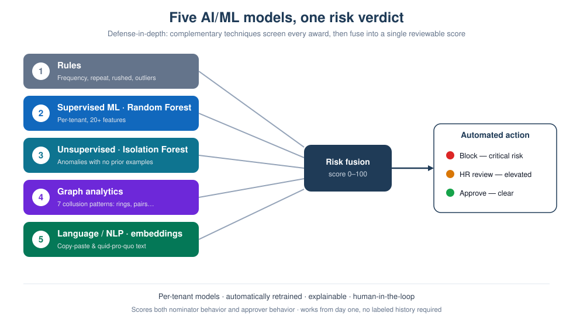
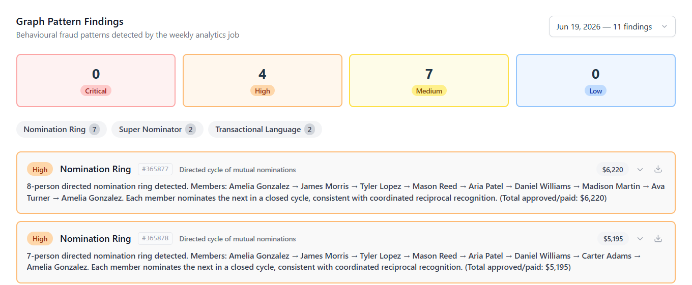
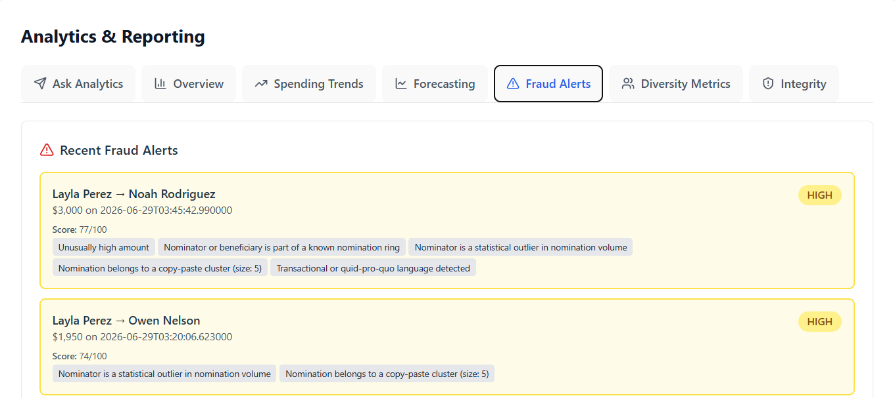
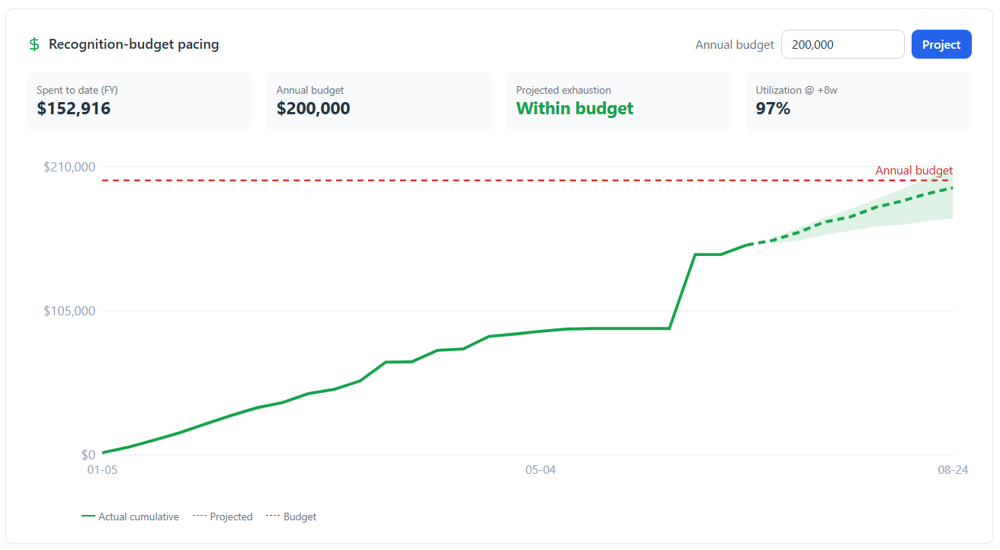
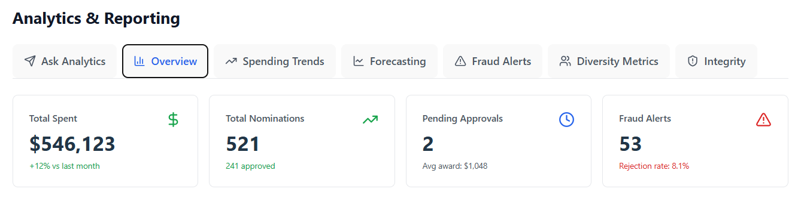

# Award Nomination System — Decision-Maker Overview

**The employee recognition platform your finance and audit teams can actually trust.**

**Powered by a multi-model AI engine that screens every award for fraud, favoritism, and collusion — before a dollar is paid.**

*Prepared by Terian Services Inc. · For HR, Total Rewards, and Finance leaders evaluating a recognition solution*

---

## The recognition paradox

Recognition works. Employees who feel seen stay longer, perform better, and speak better of you in the market. So organizations attach real budget to it — spot awards, peer nominations, monetary recognition.

And the moment real money is attached, most programs quietly break down:

- **Programs get gamed.** Reciprocal "I nominate you, you nominate me" pairs, friend-group rings, and a handful of super-nominators quietly capture a disproportionate share of the budget.
- **Favoritism goes undetected.** No one is watching the *pattern* across thousands of nominations, so managers approving their own circle looks identical to fair recognition.
- **Finance flies blind.** Where is the budget going, to which teams, and what will next quarter cost? Usually unanswerable.
- **Audit has nothing to stand on.** "Who approved this award, when, at what risk, and why?" rarely has a traceable answer.
- **HR drowns in manual approvals** and one-off spreadsheets, with no consistency across regions or languages.

The result: recognition spend that can't be defended, budgets that leak, and a program that erodes the very fairness it was meant to create.

## What if recognition were governed like spend?

Imagine running recognition the way you'd run any budget that matters: every award screened for integrity the moment it's submitted, risky ones blocked or routed for review automatically, every decision traceable, and leadership able to see spend, equity, and next-quarter forecasts at a glance — in any language, for any region, under your own brand.

That is the **Award Nomination System**.

## What it is

A multi-tenant, cloud-native SaaS platform that runs your entire monetary recognition program end to end — nomination, manager and HR review, integrity screening, payout through your own payroll, and analytics — with an **integrity engine built into the core**, not bolted on afterward.

## Why it's different: integrity is the product, not a feature

Most recognition tools are workflow with a rewards catalogue. They record *who did what*. Ours also judges *whether what happened is trustworthy* — and acts on it before money moves:

- **Screens every nomination at submission** using business rules plus a machine-learning model trained on *your* organization's own behavior.
- **Detects collusion patterns** across the whole program — rings, reciprocal pairs, super-nominators, copy-paste citations, and quid-pro-quo language — that no single-approval view can catch.
- **Acts automatically:** critical-risk awards are blocked before creation, higher-risk ones are routed to an HR reviewer with the context to decide, the rest flow through.
- **Explains itself,** so a human always makes the final call on the gray areas — and every call is logged.

This is the capability a spreadsheet, a generic form, or a rewards-catalogue vendor simply does not have.

## Inside the integrity engine: a multi-model AI approach

Fraud and favoritism don't have a single signature, so **no single model can catch them**. The Award Nomination System runs **five complementary layers of AI/ML detection** on your recognition data — the same defense-in-depth philosophy used in financial-crime systems — and fuses them into one risk score with a clear, reviewable reason.

| Layer | AI/ML technique | What it catches | Why it matters to you |
|---|---|---|---|
| **1 · Rules** | Deterministic business checks | Frequency spikes, repeat beneficiaries, rushed approvals, amount outliers | Fast, transparent guardrails you control |
| **2 · Supervised ML** | Per-tenant **Random Forest**, 20+ engineered features (behavioral, temporal, relationship, amount) | Awards that don't fit *your* organization's normal patterns | Learns *your* business, not a generic average |
| **3 · Unsupervised anomaly detection** | **Isolation Forest** | Novel, never-seen-before anomalies with no prior examples | Works on **day one** — no labeled fraud history needed |
| **4 · Graph analytics** | Network/graph models detecting **seven collusion patterns** | Rings, reciprocal pairs, super-nominators, hidden beneficiaries, quid-pro-quo clusters | Sees the *scheme* across thousands of records, not one at a time |
| **5 · Language / NLP** | Transformer **sentence-embedding** similarity | Copy-paste citations and templated or transactional justifications | Catches "recognition" that's really coordination |

What that layered approach means for you as a buyer:

- **Trained on you, not a benchmark.** Every tenant gets its *own* models, tuned to its own behavioral baseline — and they're **retrained automatically** and refreshed in production without downtime. Multi-currency and multi-region behavior is normalized so a large award in one region isn't mistaken for fraud in another.
- **Effective from day one.** The unsupervised layer bootstraps the models even before you have a single confirmed case, so there's **no cold-start** — and accuracy compounds as your reviewers make decisions that feed back as training signal.
- **Two lenses, not one.** The engine scores both **nominator behavior** *and* **approver behavior**, so it flags rubber-stamping and manager-favoritism, not just suspicious nominations.
- **Explainable and human-governed.** Only the clearest, highest-risk cases are auto-blocked; everything else is routed to a person **with the reasons attached**. Feature importance is surfaced for review, and flag rates can be monitored for fairness — the AI supports the decision, it doesn't replace the human.
- **A built-in AI analyst.** Beyond scoring, administrators can ask questions in **plain language** and get investigation summaries and exports, powered by Azure OpenAI (GPT-4o) — turning a pile of findings into a readable case in seconds.

The practical effect: **you catch more real fraud, chase fewer false alarms, and can prove — model by model — why a decision was made.** For a technical evaluator on your buying committee, this multi-model, per-tenant, continuously-retrained design is the difference between "a rules filter" and a genuine integrity platform.

**See the multi-model engine at work.** In a demonstration program of **521 nominations totaling $546,123 in awards**, the engine raised **53 fraud alerts** and its weekly graph job surfaced **11 behavioral findings** — each scored 0–100 and tagged with the exact signals behind it.

The graph job surfaces the coordinated schemes a single-record view never sees — reciprocal **nomination rings**, **super-nominators**, and **transactional / quid-pro-quo language**.

Every alert shows *why* it fired — unusually high amount, membership in a known ring, statistical volume outlier, copy-paste cluster, transactional language — so a reviewer acts with full context instead of a bare flag.

*(Figures and names shown are from the synthetic sandbox environment.)*

### A sixth model — for Finance: spend forecasting

The same AI/ML foundation also answers the question every CFO asks: *what will recognition cost next quarter?* A dedicated forecasting ensemble projects program spend **eight weeks ahead**, per team and program, by fitting several time-series models — a seasonal-naive baseline, an exponential-smoothing (Holt-Winters) model, and a gradient-boosted (LightGBM) model — and **automatically selecting the most accurate one for each series**. The result turns recognition from an unpredictable line item into a **forecastable, plannable budget**, and it feeds the same executive dashboards as the integrity metrics.

## What each stakeholder gets

| Stakeholder | What changes for them |
|---|---|
| **HR / Total Rewards** | A governed, branded, multilingual program with manager + HR review built in — no custom build, no spreadsheets. |
| **Finance** | Fraud and leakage controls on real award budget, plus spend trends and forward-looking forecasts. |
| **Employees** | A fast, fair, transparent recognition experience that people actually trust. |
| **Leadership** | Visibility into spend, department equity, and diversity of recognition — at a glance. |
| **IT & Security** | Single sign-on, private networking, and per-tenant data isolation on enterprise Azure. |
| **Audit & Compliance** | A defensible, traceable record of every score, approval, override, and payout. |

## Business outcomes you can expect

- **Protect the budget.** Stop gamed and fraudulent awards *before* they're paid, and track spend against budget in real time — instead of discovering leakage after year-end. Recognition programs often run well into six or seven figures a year, so preventing even a small share of gamed or fraudulent awards typically pays for the platform many times over.
- **Move faster.** Replace manual approval chains and email threads with one-click, SLA-tracked review — turning a multi-day, back-and-forth chase into minutes, with nothing left to languish in an inbox.
- **Make budget predictable.** Forecast recognition spend weeks ahead, by team, for planning.
- **Raise participation and fairness.** A program employees trust is a program employees use — and equity metrics prove it to leadership.
- **Be ready for audit.** Turn "we think it's fine" into a complete, exportable trail.

The platform tracks recognition spend against your annual budget and projects utilization weeks ahead — so Finance sees an overrun coming and can act, instead of discovering it at year-end.

## Built for the enterprise

- **Sign-in you already trust** — Microsoft Entra ID (Azure AD) single sign-on, with role-based access.
- **Your data, isolated** — every tenant's data is separated and scoped on every request.
- **Private by design** — a single hardened public entry point; all data services reachable only over the private Azure backbone; secrets in a managed vault; encryption in transit and at rest.
- **Global-ready** — branding, currency, and locale are configured per tenant. The interface ships in **English and Korean** today, and the localization framework adds further languages as drop-in translations — no code changes, no redeploy.
- **Always on** — active-active across two Azure regions.
- **Pays through your existing payroll** — approved award payouts flow straight to your payroll provider (Gusto, Rippling, and Workday-style systems), with payment confirmed back to the platform. Recognition that lands in the paycheck, not points or gift cards.
- **Compliance posture** — built on enterprise-grade Microsoft Azure controls: SSO, private networking, encryption in transit and at rest, per-tenant isolation, and full audit logging — with formal SOC 2 certification planned. A **Data Processing Agreement (DPA)** is available for customers with data-protection requirements.

## It's real — and you can see it today

This is not a concept deck. The platform runs in production on Microsoft Azure, with a **live, branded sandbox** you can walk through with realistic data — including deliberately planted collusion patterns so you can watch the integrity engine catch them in real time. **See it for yourself in the live sandbox: [demo-awards.terianix.ai](https://demo-awards.terianix.ai).**

Seeing it work removes the biggest risk in any SaaS purchase: *will it actually do what the brochure says?*

## Simple to adopt

Onboarding is a guided, structured rollout — not an open-ended project. Over a focused **four-week go-live plan**, we connect Entra SSO, apply your branding, import users and the manager hierarchy, configure your award categories and review rules, connect to your payroll provider so approved awards pay out automatically, and validate everything before launch. You're running recognition in **weeks, not the months** a typical enterprise implementation takes — with hands-on support the whole way.

## Plans and pricing

Three plans scale from a single team to a global enterprise. Prices shown are per month, billed annually (monthly billing available). Full comparison and current pricing: **[terianix.ai/pricing/award-nomination](https://www.terianix.ai/pricing/award-nomination)**.

| Plan | Price | What's included |
|---|---|---|
| **Starter** — up to 50 users | **$149/mo** | Peer nominations + manager approval, basic analytics dashboard, OAuth SSO (Google/Microsoft), bulk-CSV employee provisioning, manual payroll export, email support. |
| **Professional** — 50–500 users · *most popular* | **$499/mo** | Everything in Starter, plus **AI integrity analytics** (bias & anomaly detection), custom nomination categories, SAML SSO (Okta/Azure AD), daily automated employee sync, **automatic monthly payroll integration**, audit logs & API access, priority email + chat support · 99.9% SLA. |
| **Enterprise** — 500+ users | **Custom** | Everything in Professional, plus real-time API provisioning, **real-time payroll integration**, HRIS integration, a dedicated customer success manager, 99.99% SLA, and custom contract & invoicing. |

## Why now

Recognition budgets are under sharper scrutiny, hybrid and multi-region teams have made fairness harder to see, and expectations for AI-assisted, auditable governance have arrived. The organizations that get ahead of this run recognition as a trusted, measurable program — not an honor system.

## Start with a low-risk pilot

We'll stand up a branded sandbox for your organization, load a representative scenario, and show you — with your own eyes — nominations flowing, collusion being caught, and leadership dashboards populating. From there, a scoped pilot proves the value on your real program before any broad rollout.

**Next step:** **[Book a 30-minute walkthrough →](https://www.terianix.ai/contact)**

---

*Terian Services Inc. · Award Nomination System*
*Learn more about Terianix and our enterprise SaaS at [terianix.ai](https://www.terianix.ai/) · Plans and pricing at [terianix.ai/pricing/award-nomination](https://www.terianix.ai/pricing/award-nomination).*
*This document is a buyer-facing overview. Companion materials available on request: security overview, Data Processing Agreement (DPA), integration guide, and total-cost/ROI worksheet.*
