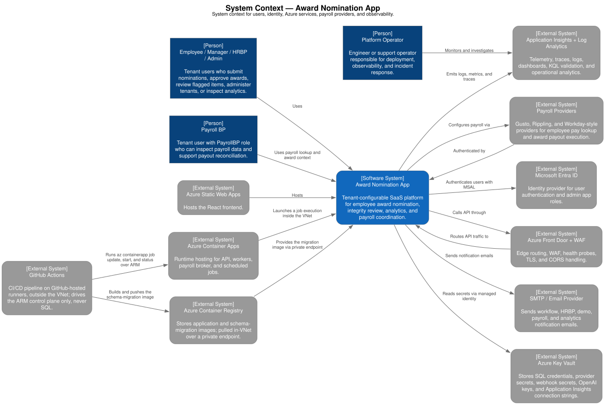
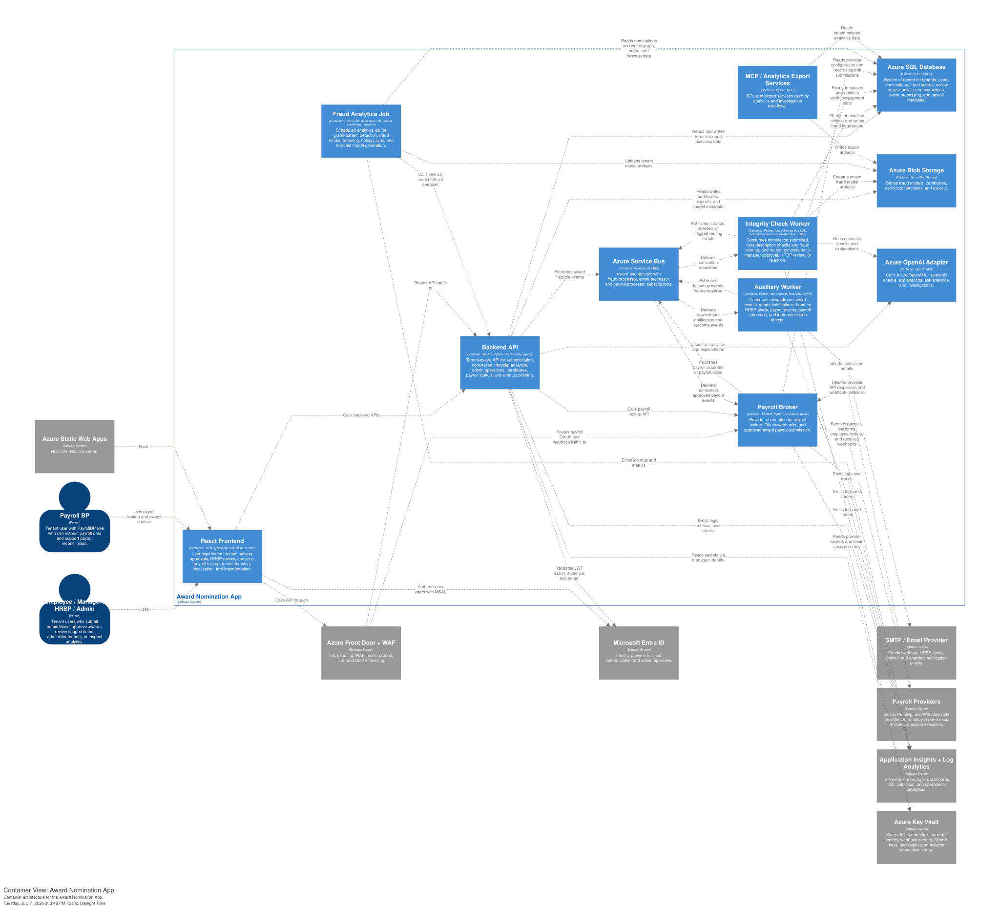
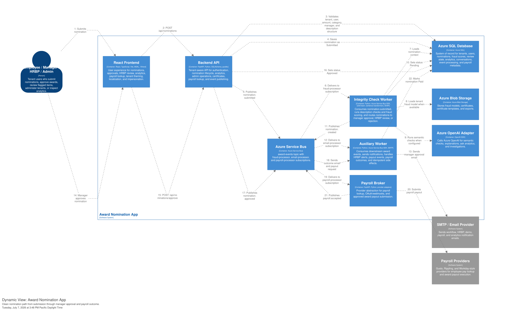
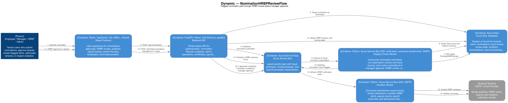
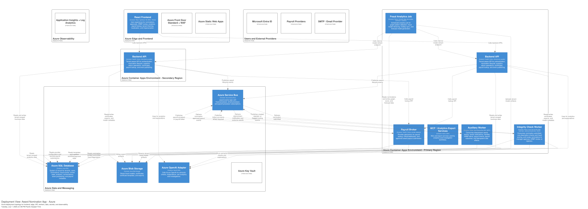

# Solution Architecture

## Architecture Summary

The solution is an Azure-native SaaS application with:

- React/Vite frontend hosted by Azure Static Web Apps.
- FastAPI backend hosted on Azure Container Apps in primary and secondary regions.
- Azure Front Door Standard and WAF routing external traffic to backend origins and payroll broker origins.
- Azure SQL as the relational system of record.
- Azure Service Bus topic and subscriptions for asynchronous workflow events.
- Separate worker services for integrity checking, notifications, payout handling, and payroll processing.
- Azure Blob Storage for fraud models, certificates, templates, and exports.
- Azure OpenAI and local ML libraries for analytics, semantic checks, and investigation support.
- Application Insights and Log Analytics for observability.

## System Context

Structured source: `../diagrams/structurizr/workspace.dsl`, view `SystemContext`.

## Major Containers

Structured source: `../diagrams/structurizr/workspace.dsl`, view `ContainerArchitecture`.

| Container | Path | Primary responsibility |
| --- | --- | --- |
| Frontend | `frontend` | User experience, MSAL sign-in, tenant theming, nomination UI, approvals, analytics, HRBP, payroll lookup. |
| Backend API | `backend` | Authentication, tenant resolution, nomination APIs, analytics APIs, admin functions, certificate SAS links, Service Bus publishing. |
| Integrity Check Worker | `integrity-check` | Consumes `nomination.submitted`, runs description checks and fraud assessment, routes clean/flagged/rejected outcomes. |
| Auxiliary Service | `auxiliary-service` | Consumes downstream events, sends email, handles HRBP alerts, payout submission, payroll results, idempotency. |
| Payroll Broker | `payroll-broker` | Consumes approval events, routes payout to provider, exposes OAuth/webhook endpoints, supports pay lookup. |
| Fraud Analytics Job | `fraud-analytics-job` | Runs weekly graph detection, model training, holiday sync, and forecast model generation. |
| MCP / Analytics services | `MCP_Servers` | SQL and export service support for analytics/investigation workflows. |

## Tenant Boundary

The tenant boundary is enforced through:

- Entra ID `tid` claim.
- `Tenants.AzureAdTenantId` allowlist lookup.
- Internal `TenantId` attached to the authenticated user context.
- Tenant-scoped user lookup.
- Tenant-scoped SQL helper functions and analytics queries.
- Domain-based tenant branding and wrong-portal detection.
- Tenant-specific configuration and categories.

## Core Workflow

Structured source: `../diagrams/structurizr/workspace.dsl`, views `NominationCleanApprovalFlow` and `NominationHRBPReviewFlow`.

## Service Bus Topology

| Topic or subscription | Filter | Consumer |
| --- | --- | --- |
| `award-events` topic | All award lifecycle events | All publishers send here. |
| `fraud-processor` subscription | `event_type = 'nomination.submitted'` | Integrity Check Worker. |
| `email-processor` subscription | `event_type != 'nomination.submitted'` | Auxiliary Service. |
| `payroll-processor` subscription | `event_type = 'nomination.approved'` | Payroll Broker. |

## Deployment Topology

Structured source: `../diagrams/structurizr/workspace.dsl`, view `AzureDeployment`.

## External Dependencies

- Microsoft Entra ID for authentication and app roles.
- Azure SQL for transactional and analytics persistence.
- Azure Service Bus for workflow events.
- Azure Blob Storage for models, certificates, certificate templates, and exports.
- Azure OpenAI for AI analytics, investigation, and explanation generation.
- SMTP/email provider for workflow notifications.
- Gusto/Rippling/Workday-style payroll providers for payout execution.
- Cloudflare/Azure DNS assets for public tenant and payroll broker domains.
