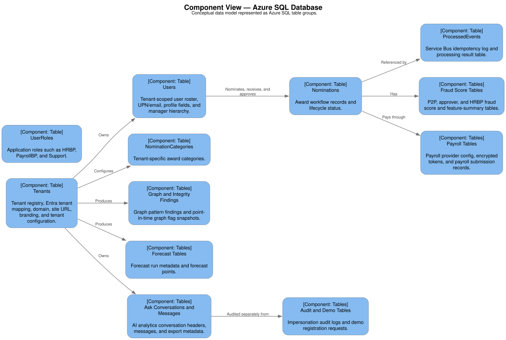

# Data Architecture

## Data Architecture Summary

Azure SQL is the primary system of record. Blob Storage stores generated and binary artifacts such as fraud models, certificates, certificate templates, and exports. Service Bus carries event envelopes but does not own long-term business state.

The data model supports:

- Multi-tenant identity and configuration.
- User roster and manager hierarchy.
- Nomination lifecycle.
- Fraud scoring and HRBP review.
- Graph analytics.
- Forecasting.
- Notifications and idempotent event processing.
- Conversations for AI analytics.
- Payroll provider integration.
- Demo registration.

## Conceptual Data Model

Structured source: `../diagrams/structurizr/workspace.dsl`, view `ConceptualDataModel`.



## Core Tables

| Table | Purpose |
| --- | --- |
| `Tenants` | Tenant registry, Entra tenant mapping, domain, site URL, branding, config, certificate config, description config, integrity config, demo flag. |
| `Users` | Tenant-scoped user roster, UPN/email, profile fields, manager hierarchy. |
| `UserRoles` | Application roles such as HRBP, PayrollBP, Support with tenant support. |
| `Nominations` | Award nomination lifecycle record. |
| `NominationCategories` | Tenant-specific award categories. |
| `ImpersonationAuditLog` | Admin impersonation audit events. |
| `ProcessedEvents` | Service Bus idempotency and result tracking. |
| `P2P_FraudScores` | Nominator-to-beneficiary fraud scores. |
| `Appr_FraudScores` | Approver-pattern fraud scores. |
| `HRBP_FraudFlags` | HRBP review detail and feature summaries. |
| `GraphPatternFindings` | Weekly graph and semantic integrity findings. |
| `UserGraphFlags` | Point-in-time user graph feature snapshots. |
| `ApproverPairFlags` | Point-in-time approver pair feature snapshots. |
| `ForecastRuns` | Forecast run metadata and metrics. |
| `Forecasts` | Forecast points by series, level, grain, and horizon. |
| `EmailTemplates` | Tenant/language-specific notification templates. |
| `Holidays` | Holiday calendar data used by forecasting and analytics. |
| `AskConversations` | AI analytics conversation headers. |
| `AskMessages` | AI analytics message history and export metadata. |
| `DemoRegistrationRequests` | Demo access request audit and rate-limiting data. |
| `payroll_providers` | Tenant payroll provider configuration. |
| `payroll_tokens` | Encrypted provider OAuth tokens. |
| `payroll_submissions` | Payroll submission status for approved nominations. |

## Nomination Data Model

Important fields:

- `NominationId`
- `TenantId`
- `NominatorId`
- `BeneficiaryId`
- `ApproverId`
- `DollarAmount`
- `Currency`
- `NominationDescription`
- `NominationDate`
- `Status`
- `ApprovedDate`
- `PayedDate`
- `ApproverNotifiedAt`
- `PaymentRef`
- `PaymentSubmittedAt`
- `RejectionReason`
- `RejectionActor`
- `CategoryId`
- `payroll_provider_id`

Known status values:

- `Submitted`
- `Pending`
- `PendingHRBPReview`
- `Approved`
- `Paid`
- `Rejected`

## Tenant Configuration Data

Tenant behavior is partly stored as JSON in `Tenants.Config` and related config columns.

Representative tenant config:

```json
{
  "locale": "en-US",
  "currency": "USD",
  "min_award": 50,
  "max_award": 5000,
  "theme": {
    "primaryColor": "#4f46e5",
    "primaryHoverColor": "#4338ca",
    "primaryLightColor": "#e0e7ff",
    "primaryTextOnDark": "#ffffff"
  }
}
```

Other tenant config areas:

- Description checks: word/character count, boilerplate phrases, embedding model, semantic thresholds.
- Certificate config: enabled, template blob, attach-to-beneficiary flag.
- Integrity config: routing thresholds and graph detection options.

## Tenant Isolation Strategy

Tenant isolation uses application-level row filtering and identity resolution:

- Token `tid` maps to `Tenants.AzureAdTenantId`.
- Authenticated user must exist in `Users` for the resolved `TenantId`.
- API handlers pass `TenantId` into SQL helper calls.
- Analytics queries are tenant-scoped.
- HRBP and payroll access is checked through tenant-scoped roles.
- Domain mismatch is detected and surfaced in frontend behavior.

Future hardening option: add database row-level security policies for defense in depth.

## Analytics Data Model

Analytics is derived mostly from:

- `Nominations`
- `Users`
- `P2P_FraudScores`
- `Appr_FraudScores`
- `HRBP_FraudFlags`
- `GraphPatternFindings`
- `ForecastRuns`
- `Forecasts`
- `UserGraphFlags`
- `ApproverPairFlags`

The analytics API returns aggregated shapes rather than exposing raw SQL tables.

## Graph Data Model

SQL graph tables include:

- `NomGraph_Person`
- `NomGraph_Nominated`
- `NomGraph_NominationEmbedding`

The weekly graph job materializes detected findings and snapshots:

- `GraphPatternFindings`
- `UserGraphFlags`
- `ApproverPairFlags`

Patterns include:

- Ring.
- Super nominator.
- Nomination desert.
- Approver affinity.
- Copy-paste.
- Transactional language.
- Hidden candidate.

## Data Lifecycle

| Data | Creation | Update | Retention recommendation |
| --- | --- | --- | --- |
| Tenant config | Tenant onboarding | Admin/ops configuration | Retain for tenant lifetime plus contract period. |
| User roster | Seed/import/onboarding | HRIS sync or admin scripts | Retain while user is active; archive after departure per policy. |
| Nominations | User submission | Workflow status changes | Retain for audit and finance period, commonly 7 years if payout-related. |
| Fraud scores | Integrity worker and weekly job | Retraining/upsert | Retain with nomination records for explainability. |
| Graph findings | Weekly job | New runs | Retain rolling windows plus audit archive. |
| Event processing | Workers | Result updates | Retain operationally, e.g. 90-365 days. |
| AI conversations | Admin analytics | User updates/deletes | Retain per tenant privacy policy. |
| Payroll tokens | OAuth onboarding | Refresh | Encrypt at rest; remove on tenant offboarding. |
| Payroll submissions | Approval payout | Webhook/worker updates | Retain with payout audit period. |

## PII and Sensitive Data

PII includes:

- Names.
- UPN and email.
- Manager relationships.
- Payroll employee profile data.
- Address and payrate data returned through payroll lookup.
- Nomination text, which may include personal details.

Sensitive operational data includes:

- Payroll OAuth tokens.
- Webhook secrets.
- SQL credentials.
- OpenAI keys.
- Storage keys.

Controls:

- Key Vault-backed secrets.
- Token encryption for payroll tokens.
- RBAC and app roles.
- Tenant-scoped access.
- Audit logs for impersonation.
- Avoid exposing raw secrets in logs.
