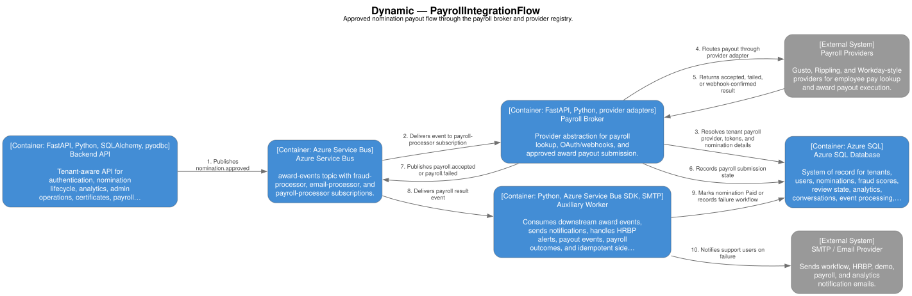

# Integration Architecture

## Integration Summary

The platform integrates through:

- Microsoft Entra ID for identity.
- Azure Service Bus for internal workflow events.
- SMTP/email for notifications.
- Payroll providers through the payroll broker.
- Azure OpenAI for AI analytics and semantic reasoning.
- Azure Blob Storage for files and model/certificate artifacts.
- Future HRIS, payroll, BI, and notification connectors.

## Current Integration Points

| Integration | Direction | Current implementation |
| --- | --- | --- |
| Microsoft Entra ID | Inbound identity | MSAL frontend and JWT validation backend. |
| Azure SQL | Read/write | Backend, workers, analytics job, payroll broker. |
| Azure Service Bus | Internal eventing | Backend, integrity worker, auxiliary worker, payroll broker. |
| Email/SMTP | Outbound notification | Auxiliary handlers. |
| Azure Blob Storage | Read/write files | Fraud models, certificates, templates, exports. |
| Azure OpenAI | Outbound AI calls | Description checks, explanations, analytics agents. |
| Gusto | Payroll provider | Payroll broker provider and webhooks. |
| Rippling | Payroll provider | Payroll broker provider structure and webhooks. |
| Workday pattern | Payroll/webhook pattern | Backend webhooks and payout/proxy references. |
| Log Analytics | Observability | KQL assets and GitHub workflows. |

## Identity Integration

Microsoft Entra ID is the identity provider. The platform expects:

- Frontend app registration.
- API app registration.
- API scope such as `api://<CLIENT_ID>/access_as_user`.
- App roles for administrators.
- Tenant registration in `Tenants`.
- User roster import into `Users`.

Future identity integrations:

- B2B guest onboarding automation.
- SCIM user provisioning.
- Group-to-role synchronization.
- Conditional Access alignment.

## HRIS Integration Direction

Current user and manager data is stored in `Users`, seeded/imported through scripts. Future HRIS integration should synchronize:

- Employee ID.
- Name.
- Work email.
- Department/title.
- Manager relationship.
- Employment status.
- Location/country.
- Cost center.

Potential providers:

- Workday.
- Oracle HCM.
- SAP SuccessFactors.
- ADP.
- Microsoft Graph / Entra ID.

Recommended pattern:

- Build an ingestion adapter per provider.
- Normalize into a tenant-scoped employee model.
- Stage incoming data before applying changes.
- Detect manager-cycle and missing-manager errors.
- Record sync run metadata and row-level errors.

## Payroll Integration

The payroll broker abstracts provider-specific payout and lookup behavior.

Current pattern:

Structured source: `../diagrams/structurizr/workspace.dsl`, view `PayrollIntegrationFlow`.



Provider responsibilities:

- OAuth onboarding.
- Token refresh.
- Employee lookup.
- Off-cycle payroll submission.
- Webhook verification.
- Callback handling.

Recommended provider contract:

- `get_employee_profile(upn, tenant_id)`
- `get_employee_pay(upn, year, month)`
- `submit_award_payout(nomination)`
- `verify_webhook(request)`
- `handle_webhook(payload)`

## Email Integration

Auxiliary worker sends emails for:

- Manager approval request.
- Nomination approved/rejected outcome.
- HRBP review request.
- HRBP review outcome.
- Description rejection.
- HRBP SLA breach.
- Demo access request.
- Payroll failure.
- Free-form analytics notification.

Email templates are tenant/language-aware through `EmailTemplates`.

Recommended future enhancements:

- Provider abstraction for SMTP, Microsoft Graph Mail, SendGrid, or Azure Communication Services.
- Delivery status tracking.
- Bounce/failure tracking.
- Tenant-specific sender domain verification.

## Analytics Export Integration

Current export paths include:

- Integrity finding Excel export.
- Ask/investigate export payloads.
- MCP analytics export service.

Future export targets:

- Power BI datasets.
- Azure Data Lake.
- Snowflake/Databricks.
- Scheduled executive PDF/email reports.
- SIEM event export.

## Webhook Integration

Webhook patterns exist for:

- Workday payment confirmation.
- Gusto payroll submitted callbacks.
- Rippling payroll run completed callbacks.
- Internal model refresh callback.
- Internal HRBP SLA callback.

Webhook requirements:

- Validate signature or shared secret.
- Enforce idempotency by provider reference.
- Persist raw callback metadata when needed for audit.
- Avoid logging secrets or full sensitive payloads.

## Event Integration Contract

Service Bus event envelope:

```json
{
  "event_type": "nomination.approved",
  "nomination_id": 42,
  "timestamp": "2026-07-07T00:00:00Z"
}
```

Optional `extra` payload can carry event-specific data such as:

- Reviewer ID.
- HRBP rejection reason.
- Payment reference.
- Notification fields.

Event metadata:

- `event_type` is also set as a Service Bus application property for broker-side SQL filters.
- Trace headers are propagated through application properties.

## Future Integration Roadmap

- HRIS roster sync.
- SCIM provisioning.
- Microsoft Teams notifications.
- Power BI semantic model.
- Webhook subscription API for tenants.
- Payroll provider certification checklist.
- Tenant-specific outbound webhook signing.
- Data export API for audit and compliance.
